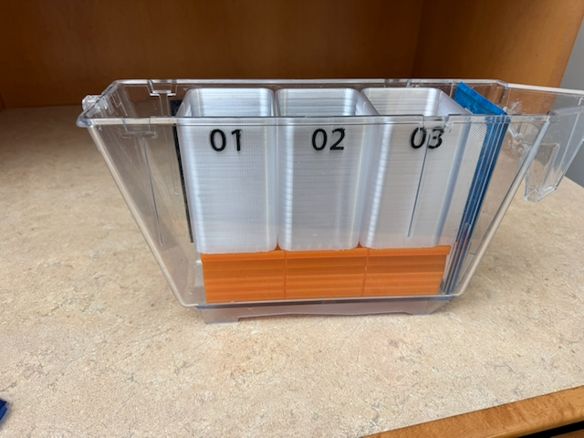
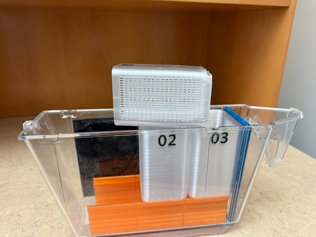

# Mandel Lab Squid Egg Baskets

The lab commissioned [Jesse Darley](https://making.engr.wisc.edu/staff/darley-jesse/) to design baskets for *Euprymna scolopes* and *Euprymna berryi* egg/embryo clutches. The current designs are listed on this site and can be enjoyed by others for non-commercial uses.

Here are the parameters we employed/refined in the design:
- Baskets are to fit in an Iwaki `AQT2LT` 2 L tank fitted with an `AQT2LC` lid and `AQT2LF10` 1000 μm filter.
- Basket height should allow the tank lid to close, to limit evaporation and salt build-up. We adjusted the initial height of the baskets to be as close to the lid as possible so that hatchlings would not surf out of the baskets if the tank was tipped while moving it off the system gutter, or to/from a counter.
- Ideal is to have up to 3 baskets per tank, but want it to be feasible to have only 1 or 2 baskets in place.
- Need to be able to see hatchlings through the tank and be able to remove them readily, so want to use transparent. *Note: The transparent PETG we are currently using allows us to see a hint of the squid but it ends up more of a translucent white than as fully transparent.*
- Water flow will be from front to back, and should be maximal through the basket (i.e., no/minimal trough in the middle where the clutches will sit).
- Slots were balanced to be small enough that squid would not pass through, large enough that water would flow through readily, and large enough to be reliably 3D printed on available instrumentation (Bambu printers).
- Plastic needs to be non-toxic for the animals. Using PETG.

Through testing, we further modified the baskets as follows:
- The side of the basket is vertical near its top—rather than matching the side of the tank—to allow room for the water to flow around the basket and limit surface tension near the top of the basket that could carry squid hatchlings out of the baskets.
- The platform was printed as a separate device from earlier prototypes. This offered two substantial benefits. First, it allowed the baskets to be a standardized shape for mass printing (rather than having a stand attached). Second, the platform design enables mounting 1, 2, or 3 baskets in a tank. The platform designed by Jesse allows users to readily snap in/out baskets without disrupting neighboring baskets (especially important if those baskets are filled with eggs!).
- The platform design additionally offers another advantage: It can fit an air stone if desired.

```
Plastic: PETG
Basket color: transparent
Number color: black
Platform color: orange (had on hand)
```


[3D Printing Files](3d-printing-files-2026-06-25)



